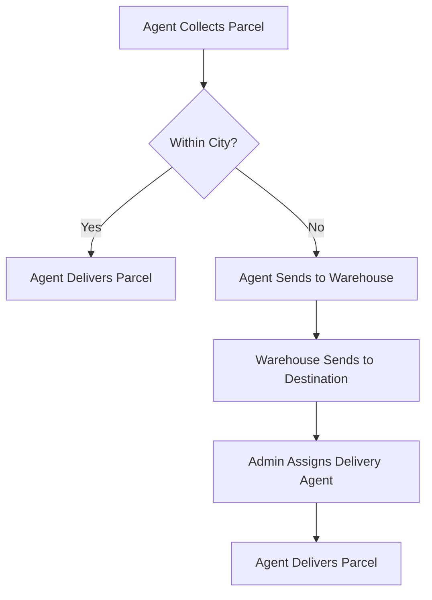

# Zap Shift Resources

Welcome to **Zap Shift Resources**!  
A curated collection of tools, guides, and assets for developing robust parcel management systems.

---

## 📊 System Overview Table

| Role               | Key Responsibilities                                                                      | Earnings/Benefits                              |
| ------------------ | ----------------------------------------------------------------------------------------- | ---------------------------------------------- |
| **Merchant**       | - Book parcels - Pay charges - Track status - Review service                     | - Real-time tracking - Feedback opportunity |
| **Admin**          | - Assign agents - Manage routing - Oversee warehouses - Monitor operations       | - System control - Operational oversight    |
| **Delivery Agent** | - Collect/Deliver parcels - Update status - OTP confirmation - Warehouse handoff | - ৳20 per delivery                             |

---

## 🛒 Pricing Structure

| Parcel Type      | Weight    | Within City | Outside City/District |
| ---------------- | --------- | ----------- | --------------------- |
| **Document**     | Any       | ৳60         | ৳80                   |
| **Non-Document** | Up to 3kg | ৳110        | ৳150                  |
| **Non-Document** | >3kg      | +৳40/kg     | +৳40/kg +৳40 extra    |

---

## 🚚 Delivery Workflow

---

## 🗂️ Key Features

- **Automated Pricing & Tracking**
- **Role-based Access & Workflow**
- **OTP-based Secure Delivery**
- **Nationwide Coverage (64 districts)**
- **Transparent Commission Structure**

---

---
